<div align="center">

<!-- Animated Header: Typing Effect -->


### 🚀 Student Data Science Project
*Turning messy raw data into clear, actionable insights.*

<p>
    
    
    
</p>

</div>

---

## 🧐 What is this Project?

**We** took a **huge, messy dataset** from the **World Health Organization (WHO)** about Tuberculosis (TB) and cleaned it up so it's ready to use.

Originally, the data was really hard to understand—it had **50+ columns**, weird codes, and lots of missing numbers. **We** simplified it down to the **13 most important columns** and filled in the blanks so we can see the full picture from **2000 to 2024**.

---

## 🎨 Before vs After

> **Goal:** Make the data easy to read for anyone (even non-experts!).

| Feature | ❌ Raw Messy Data | ✅ Our Cleaned Data |
| :--- | :--- | :--- |
| **Columns** | 50+ (Confusing!) | **13 (Clean & Clear)** |
| **Missing Data** | Lots of empty spots 🕳️ | **100% Full (Fixed!)** ✨ |
| **Names** | `e_mort_exc_tbhiv_100k` 😵‍💫 | `TB Deaths (No HIV)` 😎 |
| **Use Case** | Hard to calculate | **Ready for Charts!** 📊 |

---

## ⚙️ How We Did It (The Workflow)

**We** created a process to filter out the "noise" and keep the "signal".

```mermaid
graph TD
    %% Fun Colors for Student Theme
    classDef input fill:#ff9ff3,stroke:#f368e0,stroke-width:2px,color:black;
    classDef process fill:#54a0ff,stroke:#2e86de,stroke-width:2px,color:black;
    classDef success fill:#1dd1a1,stroke:#10ac84,stroke-width:2px,color:black;

    RawData[📂 Raw WHO Data]:::input
    
    Step1(🧹 Step 1: Cleaning):::process
    Step2(🔍 Step 2: Selecting):::process
    Step3(🧩 Step 3: Filling Gaps):::process
    
    FinalData[✨ Cleaned_Data.csv]:::success

    RawData --> Step1
    Step1 -->|Removed 40+ useless cols| Step2
    Step2 -->|Kept 13 best cols| Step3
    Step3 -->|Used Region Median| FinalData
```



---

## 🧠 Smart Move: Filling Missing Data

One big problem was **missing numbers**. For example, if a country didn't report data in 2015, we had a gap.

To fix this, **we** used a smart formula called **"Region-Year Median"**.
*   **Ideally:** **We** looked at other countries in the *same region* for the *same year*.
*   **Why Median?** Because "Averages" (Means) can be messed up by one crazy big number (outlier). The Median is safer and gives a more realistic guess!

<details>
<summary>🤓 <b>Click to see the exact Excel Formula we used!</b></summary>

**We** didn't just guess! **We** used complex logic to find the pattern. Here is the formula for calculating **TB Incidence** when data was missing:

```excel
=IF(Raw_Data!H2="",
   IFERROR(
     MEDIAN(
       FILTER(
         Raw_Data!H:H,             
         Raw_Data!E:E=C2,          // Match Region
         Raw_Data!F:F=B2,          // Match Year
         Raw_Data!H:H<>""          // Ignore Blanks
       )
     ),
   ""),
   Raw_Data!H2                     // Keep original if it exists
)
```
*Basically: "If the data is missing, find the middle value of all neighbors in that region for that specific year."*

</details>

---

### � Column Renaming Logic
**We** standardized the cryptic technical names into human-readable business terms:

| Category | 📄 Original Name | 🏷️ New Short Name |
| :--- | :--- | :--- |
| **Identification** | `Country` | **Country** |
| | `Year` | **Year** |
| | `G_whoregion` | **Region** |
| **TB Burden** | `E_inc_100k` | **TB Incidence (per 100k)** |
| | `E_inc_num` | **TB Cases** |
| **Population** | `E_pop_num` | **Population** |
| **Mortality** | `E_mort_exc_tbhiv_100k` | **TB Death Rate (No HIV, per 100k)** |
| | `E_mort_100k` | **TB Death Rate (per 100k)** |
| | `E_mort_num` | **TB Deaths** |
| **TB + HIV** | `E_inc_tbhiv_100k` | **TB-HIV Incidence (per 100k)** |
| | `E_tbhiv_prct` | **TB-HIV %** |
| **Treatment** | `Cfr_pct` | **Fatality Rate (%)** |
| | `C_cdr` | **Detection Rate (%)** |

---

## 📊 The 13 Key Metrics (Data Dictionary)

**We** carefully selected these columns because they allow us to answer the most important questions.

### 📍 Identification (Who & When)
| Column | Meaning | Why We Chose This? |
| :--- | :--- | :--- |
| **Country** | Name of the nation | Primary unit for analysis. Allows rankings & maps. |
| **Year** | 2000-2024 | Required for time-series charts to see trends. |
| **Region** | WHO Classification | Helps compare big areas (e.g., "how is Africa doing vs Europe?"). |

### 🦠 The Disease (Burden)
| Column | Meaning | Why We Chose This? |
| :--- | :--- | :--- |
| **TB Incidence (100k)** | New cases per 100k people | **The Main KPI.** Shows how bad the spread is, regardless of country size. |
| **TB Cases (Total)** | Actual number of sick people | Shows the real-world magnitude of the problem. |

### ☠️ Mortality (Impact)
| Column | Meaning | Why We Chose This? |
| :--- | :--- | :--- |
| **TB Deaths (No HIV)** | Deaths from TB alone | Measures how deadly TB is on its own. |
| **TB Deaths (Total)** | All TB-related deaths | The ultimate measure of the epidemic's cost. |
| **Fatality Rate (%)** | % of patients who die | A proxy for **Hospital Quality**. (If this is high, treatment is failing). |

### 🏥 Healthcare & Population
| Column | Meaning | Why We Chose This? |
| :--- | :--- | :--- |
| **Detection Rate (%)** | % of cases found | Measures validty of the surveillance system. |
| **Population** | Total People | Needed to understand the scale and context. |
| **TB-HIV Metrics** | Co-infection stats | Critical for understanding high-risk groups. |

---

## 🚀 What Can We Do With This?

Now that the data is clean, we can build cool things like:
*   🌎 **Animated Maps** showing TB changing over 24 years.
*   📉 **Line Charts** checking if fewer people are dying.
*   🆚 **Comparisons** between different regions.

---

<div align="center">

### 🏁 Final Result
**Rows:** 5,347 | **Columns:** 13 | **Missing Values:** 0

<i>Thanks for checking out my project!</i>
<br>
🌟 <b>Star this repo if you like data cleaning!</b> 🌟

</div>
