<div align="center">
  
<!-- Animated Wavy Header -->


<br>
<!-- Typing SVG -->


<br>
<!-- Badges -->
<p>
    
    
    
    
</p>

</div>

---

## 🧐 **Project Overview**

**We** took a complex dataset from the **World Health Organization (WHO)** regarding Tuberculosis (TB) estimates and transformed it into a clean, analytical-ready format.

Originally, the data presented significant challenges:
*   🔴 **50+ Columns** with cryptic technical names.
*   🔴 **Missing Data** across multiple years and developing nations.
*   🔴 **Inconsistent Formatting** making direct analysis impossible.

By applying rigorous data cleaning techniques and statistical imputation (using **Region-Year Median**), we condensed this into **13 essential, 100% complete metrics** covering **2000 to 2024**.


---

## 🔗 **Project Resources**

Access the live dashboard and original data sources here:

*   📊 **Interactive Dashboard (Google Sheets):** [View Live Dashboard](https://docs.google.com/spreadsheets/d/1R3yu5JeesylHFQHVl3gxzKUuvqf2MojTBwp5pXWzUgQ/edit?gid=4728412#gid=4728412)
*   💾 **Original WHO Dataset:** [Download Raw Data](https://www.who.int/teams/global-programme-on-tuberculosis-and-lung-health/data?#:~:text=WHO%20TB%20burden%20estimates%20%5B%3E1Mb%5D)

---


## 📸 **Dataset Analysis Screenshots**

<div align="center">
<!-- Placeholder for Global Dashboard -->
<br>

<br>
<i><b>Global TB Dashboard</b> - A comprehensive view of KPI cards and charts.</i>
<br><br>


---

## 📂 **File Details**

We maintain a strict separation between raw inputs and processed outputs:

| 📄 File Name | 📝 Description |
| :--- | :--- |
| **`Raw_Data.csv`** | The original WHO export. Contains 50+ columns, gaps, and technical codes. |
| **`Cleaned_Data.csv`** | **The Golden Dataset.** Contains only the 13 verified columns. No missing values. |

---

## 📊 **Data Dictionary (The 13 Key Metrics)**

We selected these specific metrics to drive our analysis.

### 📍 **Location & Time**
| Column | Detail & Usage |
| :--- | :--- |
| **Country** | **Primary Key.** The unique name of the nation/territory (e.g., "Afghanistan", "Zimbabwe"). Used for geospatial mapping. |
| **Year** | **Time Series Key.** Range: `2000` to `2024`. This allows us to track the 47.9% global drop in TB Incidence. |
| **Region** | **Category.** WHO Classification (e.g., `AFR` = Africa, `EUR` = Europe). Vital for "Region-Year" imputation logic. |

### 🧬 **The Scope of the Problem**
| Column | Detail & Usage |
| :--- | :--- |
| **TB Incidence (100k)** | **The North Star Metric.** New cases per 100,000 population. Allows fair comparison between large (India) and small (Fiji) nations. |
| **TB Cases (Total)** | The estimated absolute number of new cases. Useful for resource allocation (e.g., "How many vaccines do we need?"). |
| **TB-HIV Incidence (100k)** | Incidence of TB specifically among people living with HIV. A critical co-morbidity indicator. |
| **TB-HIV %** | Percentage of TB cases that are HIV-positive. Highlights the need for integrated HIV/TB care. |

### 💀 **The Human Cost**
| Column | Detail & Usage |
| :--- | :--- |
| **TB Death Rate (No HIV)** | Deaths per 100k people caused *only* by TB (excluding HIV co-infection). |
| **Total TB Death Rate** | The aggregate mortality rate (TB alone + TB/HIV). The truest measure of the epidemic's lethality. |
| **TB Deaths (Total)** | Absolute count of lives lost. Used for impact reporting. |
| **Fatality Rate (%)** | **Quality Proxy.** (Deaths / Cases). A high rate suggests poor treatment outcomes or late diagnosis. |

### 🏥 **Healthcare Quality**
| Column | Detail & Usage |
| :--- | :--- |
| **Detection Rate (%)** | **Surveillance Efficiency.** (Reported Cases / Estimated Cases). Low detection means "Ghost Patients" spreading the disease. |
| **Population** | Demographic context. Used as the denominator for all "per 100k" calculations. |

---

## 💡 **Key Insights & Statistics**

Based on our analysis of the 2000-2024 dataset, we derived **7 Critical Insights**:

| # | 🧠 Category | 📊 Insight Detail |
| :---: | :--- | :--- |
| **1** |  | Global TB incidence fell by **47.9%** (2000-2024), but progress has plateaued since 2015, signaling a need for new strategies. |
| **2** |  | Deaths plummeted by **73.1%**, proving that treatment works—but access remains the main barrier. |
| **3** |  | **South-East Asia (SEA)** bears the highest absolute burden, often masked by lower detection rates. |
| **4** |  | **Europe (EUR)** sets the gold standard with the lowest incidence and highest detection efficiency. |
| **5** |  | A strong **inverse relationship** exists: Low Detection = High Mortality. Missing cases are dying untreated. |
| **6** |  | Small nations like **Kiribati**, **Papua New Guinea**, and the **Philippines** show alarmingly high incidence rates (>500 per 100k). |
| **7** |  | **Africa (AFR)** and **Eastern Mediterranean (EMR)** show elevated Fatality Rates, indicating cases are found too late. |

---

## 🔍 **Analysis Suggestions**

Unlock the full potential of this dataset with these simple, effective ideas you can do right in **Google Sheets**:

### **1. Predicting the Future (Forecasts)**
*   **The Idea:** "Can we guess exactly when TB will end based on past trends?"
*   **How: Time-Series Forecasting.** By looking at the pattern of the last 24 years, we can project the line forward to 2030 to see if we will hit WHO targets or miss them.

### **2. Finding "Hidden" Epidemic Zones (Clustering)**
*   **The Idea:** "Do some countries have similar problems even if they are on opposite sides of the world?"
*   **How: Clustering.** We can group countries not by geography, but by their *symptoms* (e.g., "High Death Rate + Low Detection"). This helps finding patterns that standard maps miss.

### **3. Measuring the "Covid Effect" (Impact Analysis)**
*   **The Idea:** "Did the pandemic actually make TB worse, or was it just a blip?"
*   **How: Interrupted Time Series.** We compare what *should* have happened (based on 2000-2019 trends) vs. what *actually* happened in 2020-2021 to measure the exact damage caused by the disruption.

### **4. Proving What Works (Correlation)**
*   **The Idea:** "Does finding more patients actually save lives?"
*   **How: Correlation Analysis.** We mathematically check if higher **Detection Rates** in one year lead to lower **Death Rates** in the next. (Spoiler: They usually do!).

---

## 🧹 **Data Cleaning Notes**

Our cleaning pipeline was designed to be robust and reproducible.

### 🌊 The Workflow

```mermaid
graph LR
    classDef raw fill:#ff5555,stroke:#333,stroke-width:2px,color:white;
    classDef process fill:#3498db,stroke:#333,stroke-width:2px,color:white;
    classDef clean fill:#2ecc71,stroke:#333,stroke-width:2px,color:white;

    Raw[📂 Raw Data]:::raw --> Filter[✂️ Filter & Rename]:::process
    Filter --> Impute[🧠 Region-Year Imputation]:::process
    Impute --> Clean[✨ Cleaned_Data.csv]:::clean
```


### 🧠 **Imputation Strategy: Region-Year Median**
We rejected simple "Mean" imputation because outliers (e.g., a massive outbreak in one country) would skew the average. instead, we used **Median**.

**The Logic:**
*"If data is missing for Country X in 2015, look at its neighbors (Same Region) in 2015 and take the middle value."*

**The Exact Formula We Used:**
```excel
=IF(Raw_Data!H2="",
   IFERROR(
     MEDIAN(
       FILTER(Raw_Data!H:H,
              Raw_Data!E:E=C2,
              Raw_Data!F:F=B2,
              Raw_Data!H:H<>"")
     ),
   ""),
   Raw_Data!H2
)
```
*Translation: "Check if the cell is empty. If yes, filter column H for the matching Region (Col E) and Year (Col F), then take the Median of non-empty values. If no, keep the original value."*

---

## 📈 **Dashboard Summaries**

Our interactive dashboard provides a real-time view of the TB epidemic. Here is a breakdown of the key modules visualized above:

### **1. Global Status (The "Big Picture")**
The top-level KPIs reveal a world making progress but still facing a crisis:

*   **📉 Incidence Rate:** `97.31` per 100k **(⬇ 47.9% since 2000)**
*   **💀 Mortality Rate:** `14.29` per 100k **(⬇ 73.1% since 2000 - Major Win!)**
*   **⚠ Lethality:** `12.55%` *(1 in 8 cases is currently fatal)*

*   **Regional Outliers:**
    *   **Highest Burden:** `SEA` (South-East Asia).
    *   **Lowest Detection:** `EUR` (Europe) - *Note: This suggests a specific data reporting gap or detection issue in the latest dataset.*

### **2. Regional Risk Analysis Table**
We compared the **Fatality Rate (blue)** vs. **Death Rate per 100k (red)** across regions:
*   **AFR (Africa):** Shows the highest **Death Rate** (>35 per 100k) despite having a lower Fatality Rate than SEA. This indicates a massive volume of cases.
*   **SEA (South-East Asia):** High volatility with significant bars for both mortality metrics.
*   **EUR & AMR:** Maintain the lowest mortality figures, confirming stronger healthcare infrastructure.

### **3. Trends Over Time (2000–2024)**
The *"Average TB Incidence vs. Year"* chart demonstrates a clear, consistent downward trend:
*   **2000 Peak:** Started near ~180 per 100k.
*   **2024 Low:** Ended near ~97 per 100k.
*   The curve flattens slightly between 2015-2020, suggesting a slowing in progress that requires renewed efforts.

### **4. Top 5 High-Incidence Countries (2024)**
A drill-down into specific nations reveals extreme outliers that skew global averages:
1.  🇰🇮 **Kiribati:** `>900` cases per 100k (The highest in the dataset).
2.  🇵🇬 **Papua New Guinea:** `~650` cases per 100k.
3.  🇵🇭 **Philippines:** `~620` cases per 100k.
4.  🇱🇸 **Lesotho:** `~550` cases per 100k.
5.  🇹🇱 **Timor-Leste:** `~500` cases per 100k.

> *Observation:* Small island nations and specific high-burden African/Asian countries require targeted interventions different from the global strategy.

---


---

<div align="center">

**Created by Group 5**
<br>
<i>Empowering Health Decisions with Data.</i>

</div>
